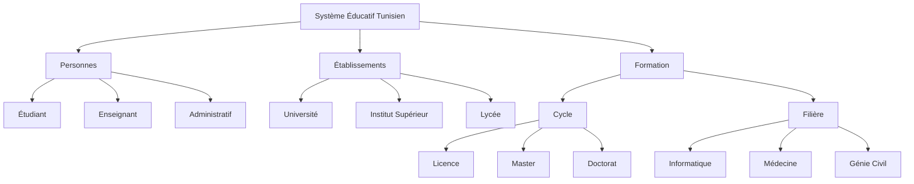

# web-sementique
 # Ontologie du Système Éducatif en Tunisie

## Phase 1 : Choix du domaine

### Domaine choisi : Système Éducatif en Tunisie

L'objectif de ce projet est de modéliser le **système éducatif tunisien** à travers une ontologie formelle permettant de représenter les **acteurs**, les **établissements**, ainsi que les **cycles et filières de formation**.

### Justification du choix

Le domaine de l'éducation en Tunisie est :
- **Structuré** : il existe des catégories bien définies (étudiants, enseignants, cycles d'études, etc.).
- **Pertinent** : il a un impact direct sur la société et l'économie tunisiennes.
- **Riche en données** : de nombreuses sources (ministère, universités, statistiques, etc.) permettent de valider le modèle.
- **Utile** : l'ontologie peut servir à construire des systèmes d’information intelligents pour la gestion de parcours étudiants, de programmes de formation, ou pour la recherche scientifique.

---

## Concepts clés identifiés

L'ontologie est structurée selon trois dimensions principales : les personnes, les établissements, et les formations.

### 1. Personnes
Représente les acteurs humains impliqués dans le système éducatif :
- **Étudiant** : inscrit dans une filière, suit un cycle de formation.
- **Enseignant** : enseigne dans un établissement et dans une filière.
- **Administratif** : gère des tâches au sein des établissements.

### 2. Établissements
Types d'établissements où se déroule l'enseignement :
- **Université**
- **Institut Supérieur**
- **Lycée**

### 3. Formation
Représente les parcours académiques et leurs spécialisations :
- **Cycle** :
  - Licence
  - Master
  - Doctorat
- **Filière** :
  - Informatique
  - Médecine
  - Génie Civil

---

## Hiérarchie du domaine


## Phase 2 : Modélisation RDF / RDFS avec Protégé

Nous avons modélisé l'ontologie à l'aide du logiciel **Protégé**.

### Namespaces utilisés

| Préfixe | URI |
|--------|-----|
| `rdf`  | http://www.w3.org/1999/02/22-rdf-syntax-ns# |
| `rdfs` | http://www.w3.org/2000/01/rdf-schema# |
| `xsd`  | http://www.w3.org/2001/XMLSchema# |
| `owl`  | http://www.w3.org/2002/07/owl# |
| `edu`  | http://www.example.org/education-tunisie# |

---

### Classes créées

- **Personne**
  - Étudiant
  - Enseignant
  - Administratif
- **Établissement**
  - Université
  - Institut Supérieur
  - Lycée
- **Formation**
  - Cycle (Licence, Master, Doctorat)
  - Filière (Informatique, Médecine, Génie Civil)

---

### Propriétés object

| Nom propriété    | Domaine        | Portée (Range)   |
|------------------|----------------|------------------|
| `étudieDans`     | Étudiant       | Établissement    |
| `enseigneDans`   | Enseignant     | Établissement    |
| `administre`     | Administratif  | Établissement    |
| `suitFormation`  | Étudiant       | Formation        |
| `aCycle`         | Formation      | Cycle            |
| `aFiliere`       | Formation      | Filière          |

---

### Propriétés data

| Nom propriété         | Domaine   | Type de données |
|-----------------------|-----------|------------------|
| `nom`                 | Personne  | `xsd:string`     |
| `age`                 | Étudiant  | `xsd:integer`    |
| `annéeInscription`    | Étudiant  | `xsd:gYear`      |

---

### Individus ajoutés

- **etudiant1**
- **etab1**
- **institut1**
- **formation1**
- **cycle14**
- **enseignant1**
- **admin1**

> Ces individus ont été définis dans Protégé et enregistrés au format RDF.

---

### Captures d’écran

> Voici quelques captures d’écran montrant la structure de l’ontologie dans Protégé :

#### 1. Vue des classes


#### 2. Propriétés objet


#### 3. Propriétés de données


#### 4. Individus créés


#### 5. ontology


---

# Phase 3 – Interrogation avec SPARQL

## Objectif de la phase

Dans cette phase, nous allons interroger notre ontologie à l’aide de requêtes **SPARQL**, en utilisant :

- Le plugin **SPARQL** de **Protégé**
- La bibliothèque **Python `rdflib`**

---

## Requête 1 – Administratifs et établissements administrés

```sparql
SELECT ?nom ?age ?etablissement ?filiere
WHERE {
  ?etudiant a edu:Étudiant ;
            edu:nom ?nom ;
            edu:age ?age ;
            edu:étudieDans ?etablissement ;
            edu:suitFormation ?formation .

  ?formation edu:aFiliere ?filiere .
}
```

>  Cette requête retourne liste noms, âges, établissements et filières de tous les étudiants..


---
## Requête 2 – Administratifs et établissements administrés

```sparql
SELECT ?nom ?cycle
WHERE {
  ?etudiant a edu:Étudiant ;
            edu:nom ?nom ;
            edu:suitFormation ?formation .
  ?formation edu:aCycle ?cycle .
}
```

>  Cette requête retourne  liste les noms des étudiants et les cycles de formation qu'ils suivent.


---
## Requête 3– Administratifs et établissements administrés

```sparql
SELECT ?enseignant ?etablissement
WHERE {
  ?enseignant a edu:Enseignant ;
              edu:enseigneDans ?etablissement .
}
```

>  Cette requête récupère les enseignants et les établissements où ils enseignent.


---
## Requête 4 – Administratifs et établissements administrés

```sparql
SELECT ?admin ?etablissement
WHERE {
  ?admin rdf:type edu:Administratif .
  ?admin edu:administre ?etablissement .
  ?etablissement rdf:type edu:Établissements .
}
```

>  Cette requête sélectionne tous les administratifs et les établissements qu'ils administrent.


---

## Exécution SPARQL avec Python 

> Nous avons aussi testé nos requêtes SPARQL via un script Python utilisant la bibliothèque rdflib

---
## Visualisation de l'ontologie :
> Voici une représentation visuelle de l'ontologie du education en tunisie :

> 

##  Restrictions OWL

L’ontologie a été enrichie par des **restrictions OWL** sur les propriétés, permettant de mieux définir les relations entre les concepts et d’imposer des contraintes logiques. Voici les principales restrictions appliquées :

---

### Sur la classe `Étudiant`

- `Étudiant ⊆ suitFormation exactly 1 Formation`  
  ➝ Un étudiant suit **exactement une** formation.

- `Étudiant ⊆ étudieDans some Établissement`  
  ➝ Un étudiant est lié à **au moins un** établissement.

- `Étudiant ⊆ nom exactly 1 xsd:string`  
  ➝ Un étudiant possède **exactement un nom**.

- `Étudiant ⊆ age exactly 1 xsd:integer`  
  ➝ Un étudiant possède **exactement un âge**.

- `Étudiant ⊆ annéeInscription exactly 1 xsd:gYear`  
  ➝ Un étudiant possède **exactement une année d’inscription**.

---

###  Sur la classe `Enseignant`

- `Enseignant ⊆ enseigneDans some Établissement`  
  ➝ Un enseignant enseigne dans **au moins un** établissement.

---

###  Sur la classe `Administratif`

- `Administratif ⊆ administre some Établissement`  
  ➝ Un personnel administratif administre **au moins un** établissement.

---

### Sur la classe `Formation`

- `Formation ⊆ aCycle some Cycle`  
  ➝ Une formation est **associée à un cycle**.

- `Formation ⊆ aFiliere some Filière`  
  ➝ Une formation **appartient à une filière**.

---

###  Sur les propriétés de données (littérales)

- `nom` : exactement **1 valeur**, de type `xsd:string`, pour toute `Personne`
- `age` : exactement **1 valeur**, de type `xsd:integer`, pour un `Étudiant`
- `annéeInscription` : exactement **1 valeur**, de type `xsd:gYear`, pour un `Étudiant`


# Ontologie du Système Éducatif en Tunisie avec SWRL

Ce projet présente une ontologie OWL modélisant le système éducatif tunisien, enrichie par des règles d'inférence SWRL pour représenter des connaissances implicites.

## Structure de l'Ontologie

### Classes principales
- **Personnes** : Classe racine pour tous les acteurs du système éducatif
  - **Étudiant** : Apprenants inscrits dans un établissement
    - **EtudiantLicence** : Étudiants en premier cycle (inféré par SWRL)
    - **EtudiantChercheur** : Doctorants
  - **Enseignant** : Personnel académique
    - **EnseignantPolyvalent** : Enseignants travaillant dans plusieurs établissements (inféré par SWRL)
  - **Administratif** : Personnel de gestion

- **Établissements** : Structures d'enseignement
  - **Université** : Offrant tous les cycles
  - **Institut_Supérieur** : Offrant licence et master
  - **Lycée** : Enseignement secondaire

- **Formation** : Programmes d'études
  - **Cycle** : Niveaux d'études
    - **Licence**
    - **Master**
    - **Doctorat**
  - **Filière** : Domaines d'études
    - **Informatique**
    - **Médecine**
    - **Génie_Civil**

### Relations (Object Properties)
- **étudieDans/aEtudiant** : Relie étudiants et établissements
- **enseigneDans/aEnseignant** : Relie enseignants et établissements
- **administre/estAdministréPar** : Relie administratifs et établissements
- **suitFormation/estSuiviPar** : Relie étudiants et formations
- **aCycle** : Associe une formation à son cycle
- **aFiliere** : Associe une formation à sa filière
- **estCollègueDe** : Relation inférée entre enseignants (symétrique)
- **mêmeAdministration** : Relation inférée entre établissements (symétrique, transitive)

### Attributs (Data Properties)
- **nom** : Nom d'une personne (string)
- **age** : Âge d'un étudiant (integer)
- **annéeInscription** : Date d'inscription (dateTime)

## Règles SWRL

L'ontologie inclut quatre règles SWRL pour enrichir les capacités d'inférence :

### 1. Identification des Étudiants en Licence
```
Étudiant(?e) ^ suitFormation(?e, ?f) ^ aCycle(?f, ?c) ^ Licence(?c) 
-> EtudiantLicence(?e)
```
**Fonction** : Classifie automatiquement les étudiants inscrits en Licence

### 2. Établissements sous même administration
```
Administratif(?a) ^ administre(?a, ?e1) ^ administre(?a, ?e2) ^ differentFrom(?e1, ?e2) 
-> mêmeAdministration(?e1, ?e2)
```
**Fonction** : Relie les établissements administrés par la même personne

### 3. Détection des collègues
```
Enseignant(?e1) ^ Enseignant(?e2) ^ enseigneDans(?e1, ?etab) ^ enseigneDans(?e2, ?etab) 
^ differentFrom(?e1, ?e2) -> estCollègueDe(?e1, ?e2)
```
**Fonction** : Établit automatiquement des relations de collègues entre enseignants

### 4. Identification des enseignants polyvalents
```
Enseignant(?ens) ^ enseigneDans(?ens, ?etab1) ^ enseigneDans(?ens, ?etab2) 
^ differentFrom(?etab1, ?etab2) -> EnseignantPolyvalent(?ens)
```
**Fonction** : Identifie les enseignants qui travaillent dans plusieurs établissements

## Contraintes OWL

L'ontologie inclut diverses contraintes OWL :

- Un étudiant suit exactement une formation
- Un enseignant enseigne dans au moins un établissement
- Un administratif gère au maximum un établissement
- Les classes Formation, Personnes et Établissements sont disjointes
- Les doctorants suivent uniquement des formations de doctorat
- Les universités peuvent proposer tous les cycles
- Les instituts supérieurs proposent uniquement licence et master
- Les lycées n'offrent pas de formations supérieures

## Exemples d'individus

L'ontologie contient plusieurs individus pour illustrer son fonctionnement :
- **etudiant1** : Un étudiant nommé "ahmed", 21 ans
- **Enseignant1**, **Enseignant2** : Deux enseignants (le second est inféré comme polyvalent)
- **admin1** : Un administrateur
- **institut1**, **etab1**, **etab2** : Des établissements
- **formation1** : Une formation en licence

## Applications potentielles

Cette ontologie peut servir à :
- Modéliser le système éducatif tunisien de manière formelle
- Faciliter l'interopérabilité entre systèmes d'information éducatifs
- Permettre des requêtes sémantiques complexes sur les données éducatives
- Analyser les relations entre différents acteurs du système

## Technologies utilisées

- OWL (Web Ontology Language)
- SWRL (Semantic Web Rule Language)
- Protégé (éditeur d'ontologies)
- Raisonneurs (HermiT, Pellet)

## Fichiers inclus

- **tets.owx** : Ontologie OWL de base
- **swrl.owx** : Ontologie enrichie avec les règles SWRL

---

*Projet développé dans le cadre d'un cours sur le Web Sémantique*


